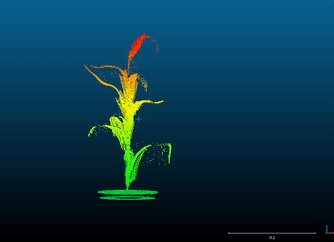

# 3D-plantModeling-with-2DLiDAR
A simulation tool for plant reconstructions based on a 2d laser sensor and a rotation disk.

<p align='center'>
    
</p>

<p align='center'>
    
    
    
    
</p> plantModeling

## Software requirements
* [Ubuntu 18.04](https://releases.ubuntu.com/18.04/)
* [ROS Melodic](http://wiki.ros.org/melodic)
* [Gazebo 9](http://gazebosim.org/download)
* Python libraries:
    * ```sudo apt-get install python-pip```
    * ```pip install numpy```
    * ```pip install pandas```

## How to install?
Clone the repository:
```
git clone https://github.com/HaroldMurcia/3D-plantModeling-with-2DLiDAR.git
```
Acces the folder:
```
cd 3D-plantModeling-with-2DLiDAR
```
Compile with catkin:
```
catkin_make
```
Move "system" to Gazebo models:
```
cp -r meshes /home/<YOUR_USER_NAME>/.gazebo/models
```

## How to run?

Acces the folder:
```
cd 3D-plantModeling-with-2DLiDAR
```
Add setup file:
```
source devel/setup.sh
```
Run rosmaster:
```
roscore
```
In a new terminal:
```
roslaunch plataforma plataforma.launcher
```
* Select a gazebo object
* Click on run
```
cd 3D-plantModeling-with-2DLiDAR/src
python Scaner3D_simulation.py <filename> <Max_Degree> <Delta_degree>
```
### License
If you use our system in an academic work, please cite:

    @article{murcia2020,
      title={Development of a Simulation Tool for 3D Plant Modeling based on 2D LiDAR Sensor},
      author={Murcia, Harold, Sanabria, David, Méndez, Dehyro and Forero, Manuel.},
      conference={Virtual Symposium in Plant Omics Sciences},
      year={2020}
     }
